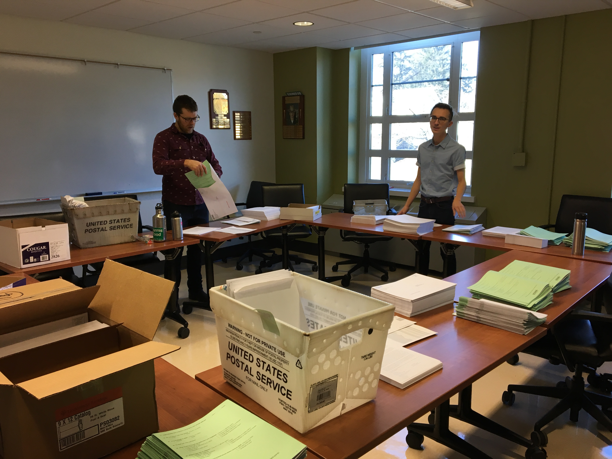
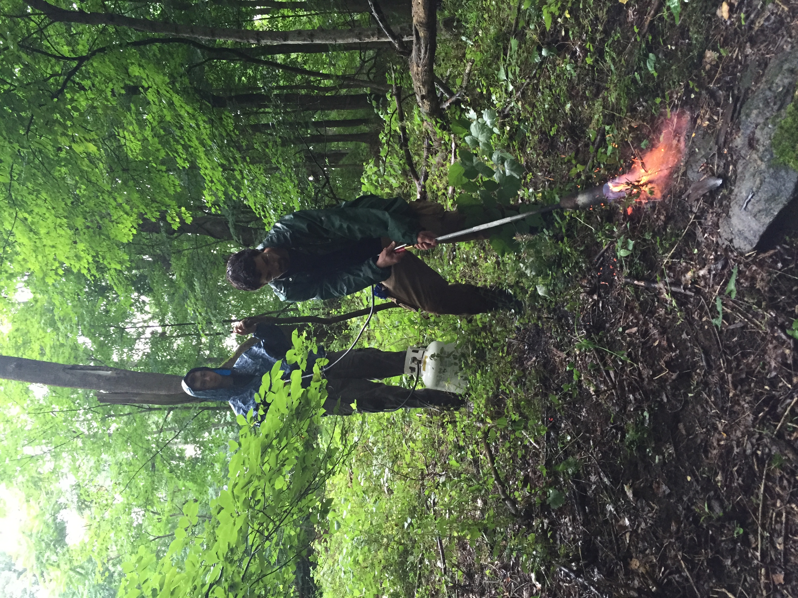
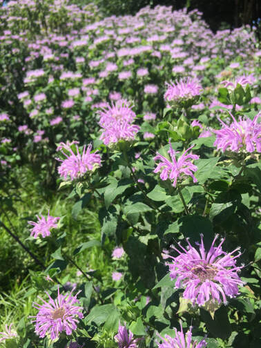

<br>
```{r echo=FALSE, out.extra='style="float:left; padding:10px"', out.width="400px"}

```
<br>

### Human dimensions of natural resource management
#### I am interested in the interaction between humans and natural resources, and how this shapes their approval of management decisions. My current research for my master's thesis is on the Human Dimensions of Roadside Vegetation Management. Utilizing social science survey methods, we hope to understand human attitudes and beliefs about roadside forests and roadside vegetation management. The goal of this research is to create new management strategies which will reduce the risk of tree-related power outages.

[Interview with Naturally@UConn](https://naturally.uconn.edu/2019/06/26/meet-graduate-student-steven-difalco/#)

<br>


<br>

### Invasive removal and habitat restoration
#### I am interested in the way exotic invasive species affect local ecosystems, and best management practices to mitigate their impacts. One of the most important parts of land management is the reestablishment of native plant populations. Restoring and maintaining native plant populations is important for helping provide habitat for our native pollinators

<br><br><br>

```{r echo=FALSE,, fig.align="default", fig.show="hold", out.width=c("50%","50%")}





```