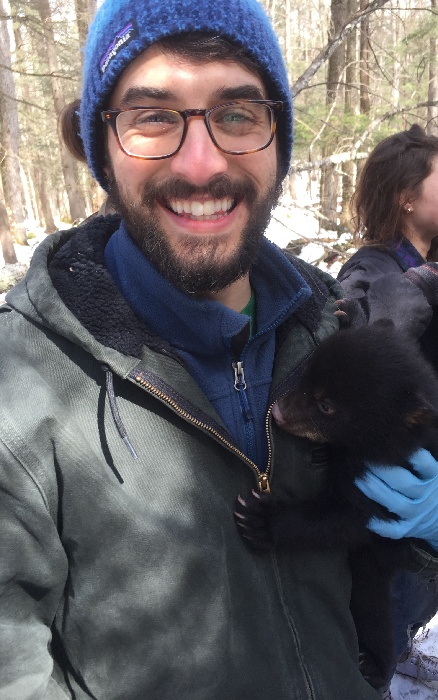

```{r echo=FALSE, out.extra='style="float:left; padding:10px"', out.width="300px"}

```

<style>
body {
text-align: justify}
</style>

#### I am currently pursuing a master's degree in Natural Resources at the University of Connecticut, where I am studying the human dimensions of roadside vegetation management. My research project involved a mail-survey to residents of Connecticut, where we asked different questions to gain an understanding of their attitudes and beliefs towards vegetation management. I use spatial analysis to see how attitudes vary based on geographic location. While at UConn, I have honed my skills in ArcGIS/ArcOnline and developed an understanding of statistical softwares such as R, Python, and SPSS.  
#### Before arriving at UConn, I worked on invasive plant management and native habitat restoration for five years. I worked at state, city, and non-profit organizations (mostly) within New York, where I was able to gain a wealth of knowledge on local and regional plant species.  
#### I received my bachelor's degree from the State University of New York at New Paltz in Biology. During my time at SUNY New Paltz, I studied the water quality of the Wallkill River and a tributary that feeds this river. 
