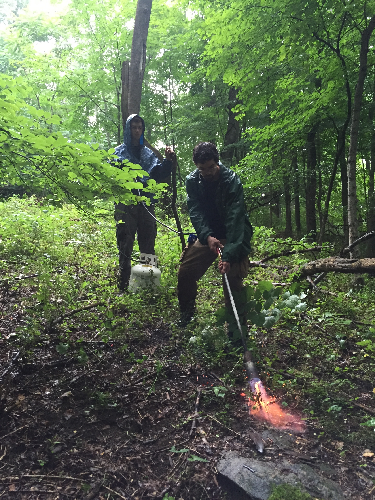
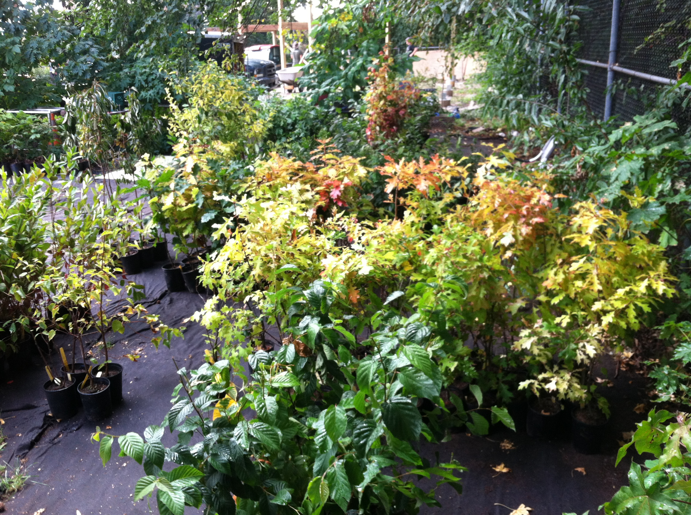

##Rockefeller State Park Preserve

```{r echo=FALSE, fig.cap=c("Crew 2016","Crew out in lake","Crew 2017", "Planting native plants after invasive removal in 2017", "Growth of natives in same site as above in 2019", "Spotted frittillary on spotted joepye", "Flame treating barberry stumps in 2017", "Bluebird eggs found in nest while monitoring boxes 2016"), out.extra="padding:10px", out.width="500px"}

knitr::include_graphics("images/Crew16.jpg")

knitr::include_graphics("images/CrewBoat.jpg")

knitr::include_graphics("images/Crew17.jpg")

knitr::include_graphics("images/treeplanting2.jpg")

knitr::include_graphics("images/treeplanting3.jpg")

knitr::include_graphics("images/joepye.jpg")



knitr::include_graphics("images/bluebirds.jpg")


```

##Prospect Park Alliance

```{r echo=FALSE, fig.cap=c("New planting area 2015","Trees ready to be planted in restoration site"), out.extra="padding:10px", out.width="500px"}

knitr::include_graphics("images/pp.png")


```

